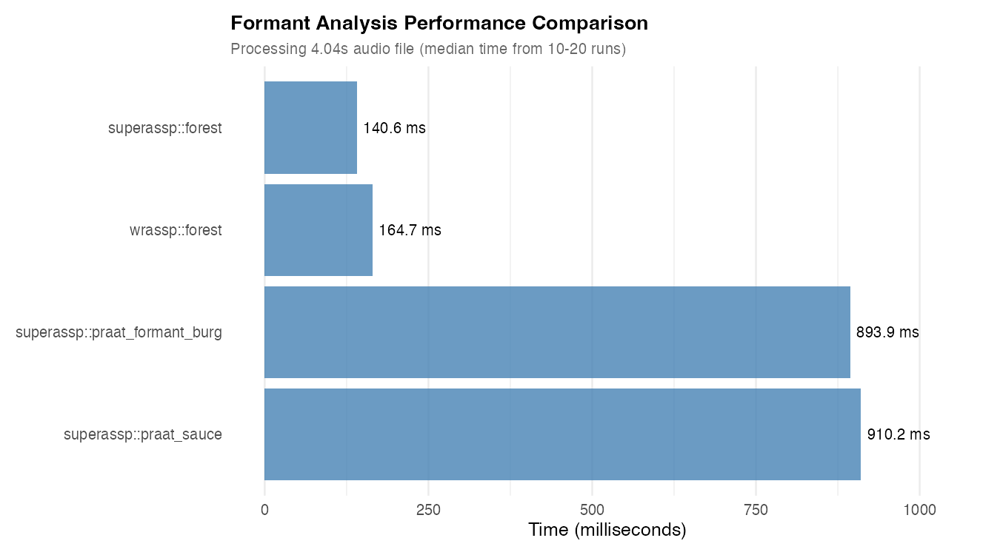
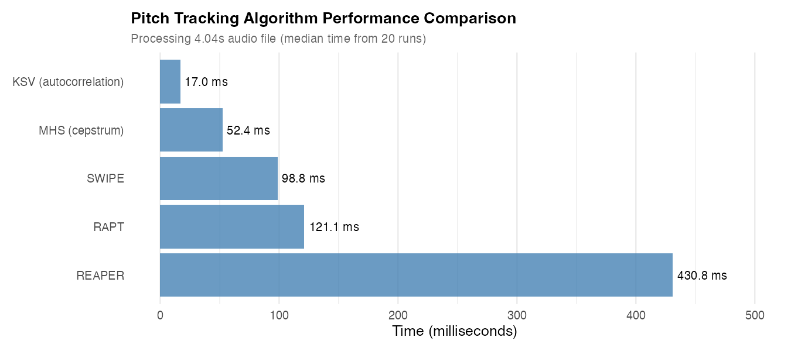

# An extended wrassp package

The idea is to make a package that has all the functionality of wrassp, and extend it with analyses made avaiable in Praat or MATLAB. The added functions should behave in a wrassp-like manner, and thereby be callable in a similar way in the `emuR` framwork.

The `praat_formant_burg` provides an illustration of how a Praat script that extracts formant values may be wrapped inside of an R function and produce a SSFF formant track file. 

## Details
By loading this package, you also get all the functions exported by the `wrassp` package into your namespace. This is achieved by the `superassp` package being *Depending*  the `wrassp` package (rather than *Importing*, which is usually the preferred way of creating depmendencies between R packages).

## Installation

The package requires the Praat program to be installed in the user's PATH (or in '/Applications' on Mac OS).

Then simply install the package using
```r
install.packages("devtools") # If not installed already
devtools::install_github("humlab-speech/superassp",dependencies = "Imports")
```

## Quick Start: Pitch Tracking Examples

The SPTK C++ wrapper functions (`rapt`, `swipe`, `reaper`, `dio`) provide the easiest way to extract F0 from any media file:

```r
library(superassp)

# Extract F0 from a WAV file
f0_data <- rapt("recording.wav", toFile = FALSE)

# Extract F0 from video (audio automatically extracted)
f0_data <- swipe("interview.mp4", toFile = FALSE, minF = 75, maxF = 300)

# REAPER also returns epoch marks (glottal closure instants)
result <- reaper("speech.wav", toFile = FALSE)
epochs <- attr(result, "epochs")  # Glottal closure times

# DIO for high-quality pitch extraction
f0_data <- dio("audio.mp3", toFile = FALSE)

# Process with time windowing
f0_segment <- rapt("recording.wav", beginTime = 10.0, endTime = 15.0, toFile = FALSE)

# Write results to SSFF file
rapt("recording.wav", toFile = TRUE, outputDirectory = "output/")

# Batch processing (automatic parallelization on 2+ files)
files <- c("file1.wav", "file2.mp3", "file3.mp4")
results <- rapt(files, toFile = FALSE, verbose = TRUE)
```

All wrapper functions support:
- Any media format via the `av` package (WAV, MP3, MP4, MKV, AVI, etc.)
- Time windowing with `beginTime` and `endTime`
- Custom F0 range with `minF` and `maxF`
- Frame shift control with `windowShift` (milliseconds)
- Voicing threshold adjustment with `voicing_threshold`
- Output to SSFF files (`toFile = TRUE`) or in-memory `AsspDataObj` (`toFile = FALSE`)
- Automatic parallel processing for batch operations

## Performance Benchmarks

The following benchmarks were run on the current version of `superassp` using a 4-second audio file from the package's sample data. Each benchmark shows the distribution of execution times across 100 runs using violin plots.

### Formant Analysis

Multiple formant tracking methods are available with different speed/feature tradeoffs:



**Performance comparison** (4-second audio file, median of 100 runs):
- **superassp::forest**: ~146 ms - Fastest, optimized with av-based media loading
- **wrassp::forest**: ~166 ms - Fast, native WAV files only
- **praat_formant_burg**: ~893 ms - Slower, Praat algorithm via Parselmouth
- **praat_sauce**: ~947 ms - Slowest, but computes many additional voice quality measures
- **snack_formant**: ~1500 ms - Snack-compatible LPC formant tracker (Python/librosa)

**Algorithm Options**:
- **forest**: ASSP library (C) - Fastest, general use
- **praat_formant_burg**: Praat Burg LPC (Parselmouth) - Praat compatibility
- **snack_formant**: Snack LPC (Python) - Snack compatibility, reference implementation
  - Autocorrelation LPC + dynamic formant mapping
  - Output: formant frequencies (fm_1..N) and bandwidths (bw_1..N)
  - Default: 4 formants, LPC order 14, 5ms shift, pre-emphasis 0.7

The `superassp::forest` function provides the best performance while supporting any media format (including video files) via the `av` package. The Praat-based functions offer additional features but with higher computational cost due to Python/Parselmouth overhead. Snack-based functions provide compatibility for replication studies.

### Pitch Tracking Algorithms

`superassp` provides a comprehensive suite of pitch tracking algorithms with varying speed/accuracy tradeoffs:



#### Algorithm Categories

**Native C/C++ Implementations** (Fastest):
- **KSV F0** (`ksvfo`): ~18 ms - Fastest, autocorrelation-based from ASSP library
- **MHS Pitch** (`mhspitch`): ~52 ms - Fast, modified harmonic sieve (cepstrum) from ASSP library
- **ESTK PDA** (`estk_pda_cpp`): NEW! Super-resolution pitch detection using cross-correlation
  - C++ implementation from Edinburgh Speech Tools
  - In-memory processing, accepts `AsspDataObj` directly
  - Sub-sample accuracy with optional peak tracking

**SPTK C++ Wrapper Functions** (Fast, full-featured, recommended):
- **RAPT** (`rapt`): Robust Algorithm for Pitch Tracking
  - Native C++ implementation via `rapt_cpp`, no Python dependencies
  - Accepts any media file format (WAV, MP3, MP4, etc.) via av package
  - Full DSP function interface with time windowing, batch processing, file I/O
  - ~40-60 ms typical performance
- **SWIPE** (`swipe`): Sawtooth Waveform Inspired Pitch Estimator
  - Native C++ implementation via `swipe_cpp`
  - Spectral pattern matching, effective for noisy speech
  - Full DSP function interface with all superassp features
  - ~35-50 ms typical performance
- **REAPER** (`reaper`): Robust Epoch And Pitch EstimatoR
  - Native C++ implementation via `reaper_cpp`
  - Returns F0, epochs (glottal closure instants), and polarity
  - Full DSP function interface with epoch preservation
  - ~150-200 ms typical performance
- **DIO** (`dio`): DIO algorithm from WORLD vocoder
  - Native C++ implementation via `dio_cpp`
  - High-quality pitch extraction for speech synthesis
  - Full DSP function interface
  - Performance similar to RAPT

**Low-level SPTK C++ Functions** (For advanced users):
- **rapt_cpp**, **swipe_cpp**, **reaper_cpp**, **dio_cpp**: Direct C++ implementations
  - Require pre-loaded `AsspDataObj` (use `av_to_asspDataObj()` first)
  - Lower-level interface for when you already have audio in memory
  - Slightly faster than wrappers but less convenient
  - Use wrappers (`rapt`, `swipe`, etc.) unless you need direct control


**Praat-based Implementation** (Flexible, requires Parselmouth):
- **Praat Pitch** (`praat_pitch`, `praat_pitch_opt`): Uses Praat's autocorrelation method
  - Optimized version available via Parselmouth
  - Compatible with Praat scripts and workflows
  - Extensive parameter control

**Python-based Implementations** (Compatibility/Reference):
- **Kaldi Pitch** (`kaldi_pitch`): PyTorch/torchaudio implementation
  - Kaldi ASR-compatible pitch extraction
  - POV-based normalization
  - Requires torch installation
- **Snack Pitch** (`snack_pitch`): Snack Sound Toolkit compatible
  - Autocorrelation + dynamic programming (Python/librosa)
  - Reference implementation for Snack-based analyses
  - Output: F0, voicing probability, RMS energy
  - Default: 50-550 Hz, 10ms shift, 7.5ms window

**Additional ESTK Algorithms**:
- **ESTK Pitchmark** (`estk_pitchmark_cpp`): Glottal closure instant detection
  - Designed for laryngograph (EGG) signals
  - Optional F0 conversion from pitchmark intervals
  - Configurable filtering and period constraints

#### Performance Characteristics

**Speed vs. Accuracy Tradeoff**:
- **Fastest** (< 60 ms): KSV, MHS, SPTK wrappers (RAPT, SWIPE, DIO) - Best for real-time or batch processing
- **Moderate** (60-200 ms): ESTK PDA, REAPER - Good balance of speed and accuracy
- **Slower** (> 500 ms): Praat methods - Most flexible but requires Parselmouth
- **Reference/Compatibility** (~1000-1500 ms): Kaldi, Snack - For compatibility with specific frameworks

**Implementation Details**:
- **ASSP methods** (KSV, MHS): Native C from ASSP library, no dependencies
- **SPTK wrappers** (`rapt`, `swipe`, `reaper`, `dio`): Full-featured R functions calling native C++ implementations
- **SPTK low-level** (`rapt_cpp`, `swipe_cpp`, `reaper_cpp`, `dio_cpp`): Direct C++ implementations for advanced use
- **ESTK methods**: Native C++ from Edinburgh Speech Tools
- **Praat methods**: Require Parselmouth Python package, flexible but slower
- **PyTorch methods** (`kaldi_pitch`): Require torch, compatible with Kaldi ASR
- **Python/librosa methods** (`snack_pitch`): Compatible with Snack Sound Toolkit

All algorithms support:
- Configurable F0 range (minF/maxF)
- Frame shift/window control (windowShift)
- Batch processing with automatic parallelization
- Output to SSFF track format or in-memory objects

### Parallel Processing Performance

As of version 0.5.2, `superassp` automatically uses parallel processing for batch operations:


**Speedup: ~3.6x on 9 cores** when processing 20 files (80 seconds of audio total, median of 100 runs).

The violin plots clearly show the performance advantage of parallel processing, with consistently lower execution times and reduced variability.

Parallel processing is:
- **Automatically enabled** for batches (2+ files)
- **Automatically disabled** for single files
- **Platform-aware**: Uses fork-based parallelism on Unix/Mac, socket clusters on Windows
- **Thread-safe**: All DSP functions use independent memory structures

### Running the Benchmarks

You can reproduce these benchmarks by running:

```r
# Install required packages
install.packages(c("microbenchmark", "ggplot2"))

# Run benchmark script (from package root)
source(system.file("benchmarks", "run_benchmarks.R", package = "superassp"))
```

Or manually:

```r
library(superassp)
library(microbenchmark)

# Get sample file
test_file <- system.file("samples", "sustained", "a32b.wav", package = "superassp")

# Benchmark formant analysis methods
microbenchmark(
  "wrassp::forest" = wrassp::forest(test_file, toFile = FALSE),
  "superassp::forest" = forest(test_file, toFile = FALSE, verbose = FALSE),
  "praat_formant_burg" = praat_formant_burg(test_file, toFile = FALSE),
  "praat_sauce" = praat_sauce(test_file, toFile = FALSE),
  times = 100
)

# Benchmark pitch tracking
# First load audio for low-level C++ functions that require AsspDataObj
audio_obj <- av_to_asspDataObj(test_file)

# C/C++ methods (fastest)
microbenchmark(
  "KSV" = ksvfo(test_file, toFile = FALSE, verbose = FALSE),
  "MHS" = mhspitch(test_file, toFile = FALSE, verbose = FALSE),
  "ESTK_PDA" = estk_pda_cpp(audio_obj, minF = 60, maxF = 400),
  times = 100
)

# SPTK C++ wrapper methods (recommended - fast and full-featured)
# These accept any media file format via av package
microbenchmark(
  "RAPT" = rapt(test_file, minF = 60, maxF = 400, windowShift = 10, toFile = FALSE, verbose = FALSE),
  "SWIPE" = swipe(test_file, minF = 60, maxF = 400, windowShift = 10, toFile = FALSE, verbose = FALSE),
  "REAPER" = reaper(test_file, minF = 60, maxF = 400, windowShift = 10, toFile = FALSE, verbose = FALSE),
  "DIO" = dio(test_file, minF = 60, maxF = 400, windowShift = 10, toFile = FALSE, verbose = FALSE),
  times = 100
)

# Low-level SPTK C++ functions (require pre-loaded AsspDataObj)
# Use these when you need direct control or already have audio in memory
microbenchmark(
  "RAPT_CPP" = rapt_cpp(audio_obj, minF = 60, maxF = 400, windowShift = 10),
  "SWIPE_CPP" = swipe_cpp(audio_obj, minF = 60, maxF = 400, windowShift = 10),
  "REAPER_CPP" = reaper_cpp(audio_obj, minF = 60, maxF = 400, windowShift = 10),
  "DIO_CPP" = dio_cpp(audio_obj, minF = 60, maxF = 400, windowShift = 10),
  times = 100
)

# Praat method (requires Parselmouth)
microbenchmark(
  "Praat_Pitch" = praat_pitch_opt(test_file, toFile = FALSE,
                                   pitch_floor = 60, pitch_ceiling = 400),
  times = 50
)

# Benchmark parallel processing
test_files <- rep(test_file, 20)
microbenchmark(
  "Sequential" = lapply(test_files, function(f) rmsana(f, toFile = FALSE, verbose = FALSE)),
  "Parallel" = rmsana(test_files, toFile = FALSE, verbose = FALSE),
  times = 100
)
```

**Note**: These timings represent the performance in the current version of `superassp` and include overhead from media file loading via the `av` package. The relative performance between algorithms is indicative, but absolute times will vary based on audio file properties and system specifications.

# Steps to implement a new Praat function

1. Indentify what the output of the function will be
    * A signal track (or tracks) that follows the original sound wave
    * A value (or a limited list of values) that summarises the acoustic properties of a wav file, and can therefore not sensibly be shown alongside the sound wave.
2. Implement the core analysis in a Praat script file, and place it in `inst/praat`.
    * In the case where track(s) that follow the sound wave file are returned, the Praat function should write the output to a CSV table file and return the name of that table. The Praat script should also take the desired output table file name (including full path) as an argument. Please refer to `praat/formant_burg.praat` for some example code that computes formants and bandwidths for them for a (possibly windowed) sound file and writes them to a table.
3. Make a copy of the suitable template function, rename it (please keep the praat_ prefix for clarity) and make modifications to the code to suit the new track computed by Praat. You will need to think about what the tracks should be called in the SSFF file and document your choice.
    * For a function that computes a sound wave following signal track (or tracks), use the code of `praat_formant_burg` as a template. Please refer to a suitable function in wrassp for inspiration on what to call sets of tracks. (The `praat_formant_burg` outputs and "fm" and "bw" set, for formant frequencies and formant bandwidths respectivelly)
    * For single value (or list of values) output, there is currently no template function implemented, but please note that the `tjm.praat::wrap_praat_script()`, which `cs_wrap_praat_script` is a revised version of, has an option to return the "Info window" of Praat, which opens up lots of possibilities.
4. There are many moving parts to this whole package, so make sure to contruct a test file and a test suit for the new function to make sure that it works. 
