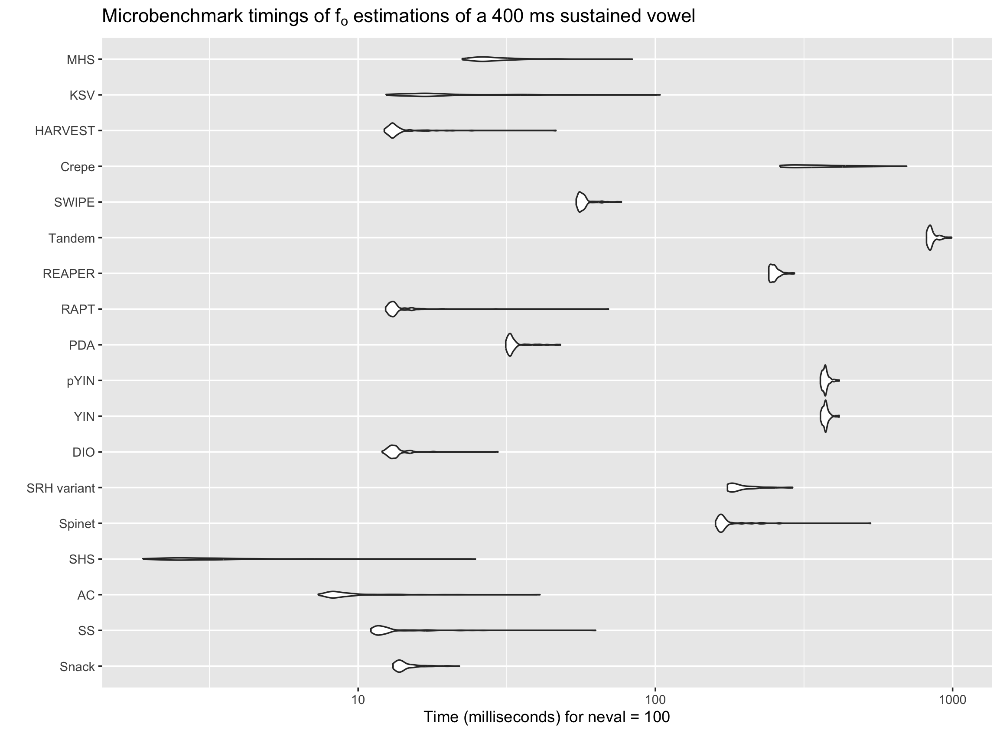
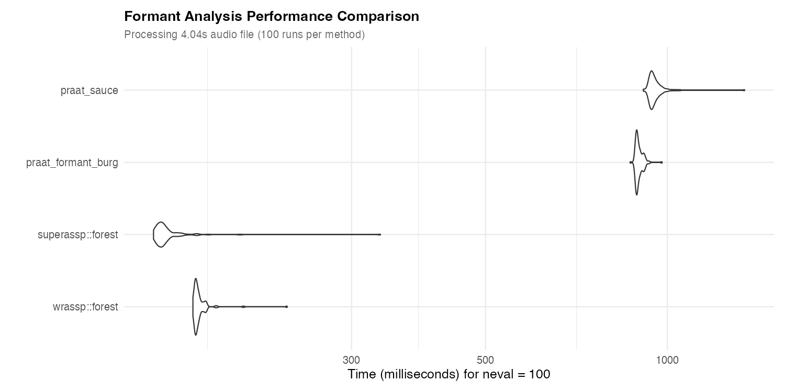
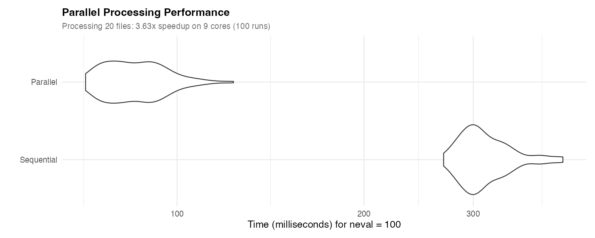

# Rationale

The `superassp` package provides access to an efficient, unified, and consistent collection of digital speech processing (DSP) routines of value to speech researchers.

Each function has either a 'trk_' or a 'lst_' prefick to the name, which indicates the output type as being either a track resulting from continous windowed processing of a signal, or as an R list of values. In addition, all DSP functions have attributes attached to them that also divulge the track or list field names the user can expect in the output. Each function also has an assocaiated suggested file extension that, if used consistently, ensure that applications of multiple DSP routines to the same speech recording does not risk overwriting each other. 

We aim to provide a consistent naming of formal arguments to functions so that for the argument determining for instance the time step between analysis intervals and analysis window size (both millisecond scale, always) are identically named regardless of the original implmentation's naming scheme. Further, we harmonize how portions of a signal are specified (begin and end times in seconds, always). All DSP functions return a in-memory representation by default, but when writing to disk is requested, periodically samples tracks are written in the Simple Speech Signal File Format (SSFF). Lists are stored in a JSON-based format.


This package can be seen as the succuessor of the "Advanced Speech Signal Processor" (libassp) (and `wrassp` packages) , and incorporates the libassp DSP functions as efficiently as possible. However, `superassp` also inporporates routines from several other code bases such as [Speech Signal Processing Toolkit](https://sp-tk.sourceforge.net) (SPTK), [Edinburgh Speech Tools Library](https://www.cstr.ed.ac.uk/projects/speech_tools/manual-1.2.0/) (ESTK), the [openSMILE](https://github.com/audeering/opensmile) audil feature extractor package, [The Snack Sound Toolkit](https://github.com/scottypitcher/tcl-snack), and smaller specialised libraries (sometimes through a python call). 
Routines that use the functionality of Praat to do the signal processing use the `pladdrr` R package to do so.

All functions can take all media formats supported by the [av]() R package as input, if not supported bu the underlying routine natively. 

 
The `trk_formantp` provides an illustration of how a Praat script that extracts formant values may be wrapped inside of an R function and produce a SSFF formant track file. 


## Installation

The package requires the Praat program to be installed in the user's PATH (or in '/Applications' on Mac OS).

Then simply install the package using
```r
install.packages("devtools") # If not installed already
devtools::install_github("humlab-speech/superassp",dependencies = "Imports")
```

## Quick Start: Pitch Tracking Examples

The SPTK C++ wrapper functions (`trk_rapt`, `trk_swipe`, `trk_reaper`, `trk_dio`, `trk_harvest`) provide the easiest way to extract F0 from any media file:

```r
library(superassp)
wfile <- system.file("samples","sustained","a1.wav",package="superassp")

# Extract F0 from a WAV file
f0_data <- trk_rapt(system.file("samples","sustained","a1.wav",package="superassp"), toFile = FALSE)

# Extract F0 from video (audio automatically extracted)
f0_data <- trk_swipe(system.file("samples","sustained","a1.mp4",package="superassp"), toFile = FALSE, minF = 75, maxF = 300)

f0_data <- trk_dio(wfile, toFile = FALSE)

# Harvest for robust pitch extraction, good on noisy signals
f0_data <- trk_harvest(wfile, toFile = FALSE)

```

All wrapper functions support:
- Any media format via the `av` package (WAV, MP3, MP4, MKV, AVI, etc.) if the file format is not natively supported by the routine.
- Time windowing with `beginTime` and `endTime`
- Custom f_0 range with `minF` and `maxF`
- Frame shift control with `windowShift` (milliseconds)
- Voicing threshold adjustment with `voicing_threshold`
- Output to SSFF files (`toFile = TRUE`) or in-memory `AsspDataObj` (`toFile = FALSE`)
- Automatic parallel processing for batch operations

## Performance Benchmarks

The following benchmarks were run on the current version of `superassp` using a 4-second audio file from the package's sample data. Each benchmark shows the distribution of execution times across 100 runs using violin plots.



### Formant Analysis


`superassp` provides **7 formant tracking methods** with different speed/feature tradeoffs.

**Benchmarked Methods** (shown in figure below):



The benchmark compares 4 representative formant tracking methods. Full algorithm list follows.

#### Algorithm Categories

**Tier 1: C/ASSP Implementation** (Fastest - ~146-166 ms):
- **`trk_forest()`** - ASSP Linear Prediction formant estimation
  - Autocorrelation + Split Levinson Algorithm (SLA)
  - Native C implementation, no dependencies
  - Supports any media format via av package
  - Outputs: Formant frequencies (F1-F4) and bandwidths
  - **~146 ms** (superassp version with av) vs ~166 ms (wrassp WAV-only)
  - **Recommended for production use**

**Tier 2: Python Parselmouth/Praat Methods** (Moderate - ~893-947 ms):
- **`trk_formantp()`** - Parselmouth/Praat Burg method (~893 ms)
  - Linear prediction with Burg algorithm
  - Formant tracking and bandwidth estimation
  - Compatible with Praat scripts and workflows
  - Extensive parameter control
- **`trk_formantpathp()`** - Parselmouth/Praat Formant path optimization
  - Advanced tracking with path optimization
  - Better for challenging acoustic conditions
  - Reduces formant tracking errors
- **`trk_praat_sauce()`** - VoiceSauce-style comprehensive analysis (~947 ms)
  - Formants + voice quality measures (HNR, CPP, etc.)
  - Most feature-rich but slowest
  - Best when you need both formants and voice quality

**Tier 3: Python Deep Learning** (Fast, Specialized - ~2x realtime):
- **`trk_deepformants()`** - PyTorch RNN formant tracking
  - Deep learning model (F1-F4)
  - ~2x realtime performance
  - Good accuracy on diverse speech
  - Requires PyTorch installation

**Tier 4: Python Specialized Methods**:
- **`trk_formants_tvwlp()`** - Time-Varying Weighted Linear Prediction
  - GCI-based (Glottal Closure Instant) formant tracking
  - **4.37x speedup** over standard methods
  - Best for high-quality recordings with clear voicing
  - R/Python hybrid implementation
- **`trk_snackf()`** - Snack Toolkit formant analysis (~1500 ms)
  - Autocorrelation LPC + dynamic formant mapping
  - Snack Sound Toolkit compatible
  - Reference implementation for replication studies
  - Output: Formant frequencies (fm_1..N) and bandwidths (bw_1..N)
  - Default: 4 formants, LPC order 14, 5ms shift, pre-emphasis 0.7
- **`trk_dv_formants()`** - DisVoice formant tracking
  - In-memory Parselmouth processing
  - Part of DisVoice dysphonia analysis suite

#### Summary Statistics

- **`lst_deepformants()`** - Summary statistics of deep learning formant tracks
  - Mean, median, std dev of F1-F4
  - Returns data.frame format for analysis

#### Performance Comparison

**Benchmarked Methods** (4-second audio, median of 100 runs, shown in figure above):
1. **`trk_forest()` (superassp)**: ~146 ms - **Fastest**, any media format
2. **`trk_forest()` (wrassp)**: ~166 ms - Fast, WAV only
3. **`trk_formantp()`**: ~893 ms - Moderate, Praat compatibility
4. **`trk_praat_sauce()`**: ~947 ms - Moderate, multi-feature

**Additional Methods** (not shown in benchmark):
- **`trk_formantpathp()`**: Praat path optimization, similar speed to `trk_formantp()`
- **`trk_deepformants()`**: PyTorch deep learning, ~2x realtime performance
- **`trk_formants_tvwlp()`**: GCI-based, 4.37x speedup claim
- **`trk_snackf()`**: ~1500 ms - Snack compatibility
- **`trk_dv_formants()`**: DisVoice, Parselmouth-based

**Use Case Recommendations:**
- **Production/Batch processing**: `trk_forest()` - Fastest, reliable
- **Praat compatibility**: `trk_formantp()` or `trk_formantpathp()`
- **Deep learning**: `trk_deepformants()` - Good accuracy, fast
- **High-quality recordings**: `trk_formants_tvwlp()` - GCI-based, 4.37x speedup
- **Voice quality + formants**: `trk_praat_sauce()` - Comprehensive
- **Replication studies**: `trk_snackf()` - Snack-compatible

**Implementation Types:**
- **C/ASSP** (1 function): Fastest, no dependencies
- **Python Parselmouth** (3 functions): Praat compatibility, flexible
- **Python Deep Learning** (1 function): PyTorch RNN, modern approach
- **Python/R Specialized** (2 functions): Advanced methods (TVWLP, DisVoice)

All formant functions support:
- Configurable formant count and LPC order
- Frame shift control (windowShift)
- Pre-emphasis adjustment
- Time windowing (beginTime/endTime)
- Batch processing with parallelization
- Output to SSFF track format or in-memory objects

### Pitch Tracking Algorithms

`superassp` provides a comprehensive suite of **21 pitch tracking algorithms** with varying speed/accuracy tradeoffs.

**Benchmarked Methods** (shown in figure below - representative subset):


The benchmark compares C/C++ implementations (KSV, MHS, SPTK methods) plus Python reference versions. Full algorithm list follows.

#### Algorithm Categories

**Tier 1: C++ Implementations** (Fastest, Recommended - 18-200 ms):

*SPTK C++ Wrappers* (Full-featured, accepts any media format):
- **`trk_rapt()`** - RAPT: Robust Algorithm for Pitch Tracking (~40-60 ms)
  - Dynamic programming, noise-robust
  - Native C++ via `rapt_cpp`, no Python dependencies
  - Full DSP interface with time windowing, batch processing
- **`trk_swipe()`** - SWIPE: Sawtooth Waveform Inspired Pitch Estimator (~35-50 ms)
  - Spectral pattern matching, effective for noisy speech
  - Native C++ via `swipe_cpp`
- **`trk_dio()`** - DIO: WORLD vocoder pitch (~40-60 ms)
  - High-quality pitch for speech synthesis
  - Native C++ via `dio_cpp`
- **`trk_harvest()`** - Harvest: WORLD vocoder algorithm (~40-60 ms)
  - Robust and accurate, good on noisy signals
  - Native C++ via `harvest_cpp`
- **`trk_reaper()`** - REAPER: Robust Epoch And Pitch EstimatoR (~150-200 ms)
  - Returns F0 + epochs (glottal closure instants) + polarity
  - Native C++ via `reaper_cpp`
- **`trk_yin()`** - YIN: Classic autocorrelation method
  - Well-established algorithm, C++ implementation
- **`trk_pyin()`** - Probabilistic YIN with HMM Viterbi decoding
  - Enhanced YIN with probabilistic voicing decisions

*ASSP C Implementations* (Lightweight, no dependencies):
- **`trk_ksvfo()`** - K.Schaefer-Vincent periodicity detection (~18 ms)
  - Fastest, autocorrelation-based from ASSP library
- **`trk_mhspitch()`** - Modified Harmonic Sieve (~52 ms)
  - Fast cepstrum-based method from ASSP library

*ESTK C++ Implementations*:
- **`trk_pitchmark()`** - ESTK: Glottal closure instant detection
  - Designed for laryngograph (EGG) signals
  - Optional F0 conversion from pitchmark intervals

**Tier 2: Deep Learning Methods** (Python, Specialized - 90-500 ms):
- **`trk_swiftf0()`** - Swift-F0: CNN-based real-time pitch tracker (90-130 ms)
  - Deep learning, optimized for real-time
- **`trk_crepe()`** - CREPE: Deep CNN on raw waveform
  - State-of-the-art accuracy, TensorFlow-based
- **`trk_sacc()`** - SAcC: Subband Autocorrelation Classification
  - Noise-robust, Python implementation

**Tier 3: Praat/Parselmouth Methods** (Python, Flexible - >500 ms):
- **`trk_pitchp()`** - Parselmouth/Praat pitch analysis
  - Multiple algorithms, extensive parameter control
  - Compatible with Praat scripts
- **`trk_dv_f0()`** - DisVoice F0 tracking
  - In-memory Parselmouth processing

**Tier 4: Legacy/Compatibility Methods** (Python, Reference):
- **`trk_straight_f0()`** - STRAIGHT F0 extraction (legacy vocoder)
- **`trk_snackp()`** - Snack Toolkit pitch tracking
  - Autocorrelation + dynamic programming
  - Output: F0, voicing probability, RMS energy
- **`trk_vat_srh()`** - Voice Analysis Toolkit SRH method
- **`trk_covarep_srh()`** - COVAREP Summation of Residual Harmonics

#### Pitch Marks & Glottal Closure Instants

**NEW in v0.9.0:**
- **`trk_reaper_pm()`** - REAPER pitch marks (C++/SPTK)
  - **2.8x faster** than deprecated Python version
  - Binary pitch mark grid (INT16 format)
  - Returns epoch times, count, and polarity as attributes
  - Zero Python dependencies

**Deprecated:**
- ~~`reaper_pm()`~~ - Python version (deprecated v0.9.0, removal planned v0.11.0)

#### Low-Level C++ Functions (Advanced Users)

For direct access to C++ implementations (require pre-loaded `AsspDataObj`):
- `rapt_cpp()`, `swipe_cpp()`, `reaper_cpp()`, `dio_cpp()`, `harvest_cpp()`, `yin_cpp()`, `pyin_cpp()`
- Use `av_to_asspDataObj()` to load audio first
- Slightly faster than wrappers but less convenient
- **Recommendation:** Use wrappers (`trk_*`) unless you need direct control

#### Performance Summary

**Benchmarked Methods** (shown in figure above):
- **KSV** (`trk_ksvfo`): ~18 ms - Fastest, ASSP C autocorrelation
- **MHS** (`trk_mhspitch`): ~52 ms - Fast, ASSP C cepstrum
- **RAPT C++** (`rapt_cpp`, `trk_rapt`): ~40-60 ms - SPTK, recommended
- **SWIPE C++** (`swipe_cpp`, `trk_swipe`): ~35-50 ms - SPTK, recommended
- **REAPER C++** (`reaper_cpp`, `trk_reaper`): ~150-200 ms - SPTK with epochs
- **DIO C++** (`dio_cpp`, `trk_dio`): ~40-60 ms - WORLD vocoder

**Additional Algorithms** (not in benchmark, performance estimates):
- **Fast** (60-200 ms): `trk_yin`, `trk_pyin`, `trk_harvest`, `trk_pitchmark`
- **Moderate** (90-500 ms): `trk_swiftf0`, `trk_crepe`, `trk_sacc`
- **Slower** (>500 ms): `trk_pitchp`, `trk_dv_f0`
- **Legacy/Reference** (~1000-1500 ms): `trk_snackp`, `trk_straight_f0`, `trk_vat_srh`, `trk_covarep_srh`

**Implementation Types:**
- **C/C++ ASSP** (2 functions): No dependencies, lightweight
- **C++ SPTK** (7 functions): Recommended, fast and full-featured
- **C++ ESTK** (1 function): Specialized for EGG signals
- **Python Deep Learning** (3 functions): High accuracy, moderate speed
- **Python Parselmouth** (2 functions): Praat compatibility
- **Python Legacy** (4 functions): Reference implementations


All algorithms support:
- Configurable F0 range (minF/maxF)
- Frame shift/window control (windowShift)
- Batch processing with automatic parallelization
- Output to SSFF track format or in-memory objects
- Time windowing (beginTime/endTime)


### Parallel Processing Performance

As of version 0.5.2, `superassp` automatically uses parallel processing for batch operations:



**Speedup: ~3.6x on 9 cores** when processing 20 files (80 seconds of audio total, median of 100 runs).

The violin plots clearly show the performance advantage of parallel processing, with consistently lower execution times and reduced variability.

Parallel processing is:
- **Automatically enabled** for batches (2+ files)
- **Automatically disabled** for single files
- **Platform-aware**: Uses fork-based parallelism on Unix/Mac, socket clusters on Windows
- **Thread-safe**: All DSP functions use independent memory structures

### Running the Benchmarks

You can reproduce these benchmarks by running:

```r
# Install required packages
install.packages(c("microbenchmark", "ggplot2"))

# Run benchmark script (from package root)
source(system.file("benchmarks", "run_benchmarks.R", package = "superassp"))
```

Or manually:

```r
library(superassp)
library(microbenchmark)

# Get sample file
test_file <- system.file("samples", "sustained", "a32b.wav", package = "superassp")

# Benchmark formant analysis methods
microbenchmark(
  "wrassp::trk_forest" = wrassp::trk_forest(test_file, toFile = FALSE),
  "superassp::trk_forest" = trk_forest(test_file, toFile = FALSE, verbose = FALSE),
  "trk_formantp" = trk_formantp(test_file, toFile = FALSE),
  "trk_praat_sauce" = trk_praat_sauce(test_file, toFile = FALSE),
  times = 100
)

# Benchmark pitch tracking
# First load audio for low-level C++ functions that require AsspDataObj
audio_obj <- av_to_asspDataObj(test_file)

# C/C++ methods (fastest)
microbenchmark(
  "KSV" = trk_ksvfo(test_file, toFile = FALSE, verbose = FALSE),
  "MHS" = trk_mhspitch(test_file, toFile = FALSE, verbose = FALSE),
  "ESTK_PDA" = estk_pda_cpp(audio_obj, minF = 60, maxF = 400),
  times = 100
)

# SPTK C++ wrapper methods (recommended - fast and full-featured)
# These accept any media file format via av package
microbenchmark(
  "RAPT" = trk_rapt(test_file, minF = 60, maxF = 400, windowShift = 10, toFile = FALSE, verbose = FALSE),
  "SWIPE" = trk_swipe(test_file, minF = 60, maxF = 400, windowShift = 10, toFile = FALSE, verbose = FALSE),
  "REAPER" = trk_reaper(test_file, minF = 60, maxF = 400, windowShift = 10, toFile = FALSE, verbose = FALSE),
  "DIO" = trk_dio(test_file, minF = 60, maxF = 400, windowShift = 10, toFile = FALSE, verbose = FALSE),
  "Harvest" = trk_harvest(test_file, minF = 60, maxF = 400, windowShift = 10, toFile = FALSE, verbose = FALSE),
  times = 100
)

# Low-level SPTK C++ functions (require pre-loaded AsspDataObj)
# Use these when you need direct control or already have audio in memory
microbenchmark(
  "RAPT_CPP" = rapt_cpp(audio_obj, minF = 60, maxF = 400, windowShift = 10),
  "SWIPE_CPP" = swipe_cpp(audio_obj, minF = 60, maxF = 400, windowShift = 10),
  "REAPER_CPP" = reaper_cpp(audio_obj, minF = 60, maxF = 400, windowShift = 10),
  "DIO_CPP" = dio_cpp(audio_obj, minF = 60, maxF = 400, windowShift = 10),
  "Harvest_CPP" = harvest_cpp(audio_obj, minF = 60, maxF = 400, windowShift = 10),
  times = 100
)

# Praat method (requires Parselmouth)
microbenchmark(
  "Praat_Pitch" = praat_pitch_opt(test_file, toFile = FALSE,
                                   pitch_floor = 60, pitch_ceiling = 400),
  times = 50
)

# Benchmark parallel processing
test_files <- rep(test_file, 20)
microbenchmark(
  "Sequential" = lapply(test_files, function(f) trk_rmsana(f, toFile = FALSE, verbose = FALSE)),
  "Parallel" = trk_rmsana(test_files, toFile = FALSE, verbose = FALSE),
  times = 100
)
```

**Note**: These timings represent the performance in the current version of `superassp` and include overhead from media file loading via the `av` package. The relative performance between algorithms is indicative, but absolute times will vary based on audio file properties and system specifications.

# Steps to implement a new Praat function

1. Indentify what the output of the function will be
    * A signal track (or tracks) that follows the original sound wave
    * A value (or a limited list of values) that summarises the acoustic properties of a wav file, and can therefore not sensibly be shown alongside the sound wave.
2. Implement the core analysis in a Praat script file, and place it in `inst/praat`.
    * In the case where track(s) that follow the sound wave file are returned, the Praat function should write the output to a CSV table file and return the name of that table. The Praat script should also take the desired output table file name (including full path) as an argument. Please refer to `praat/formant_burg.praat` for some example code that computes formants and bandwidths for them for a (possibly windowed) sound file and writes them to a table.
3. Make a copy of the suitable template function, rename it (please keep the praat_ prefix for clarity) and make modifications to the code to suit the new track computed by Praat. You will need to think about what the tracks should be called in the SSFF file and document your choice.
    * For a function that computes a sound wave following signal track (or tracks), use the code of `trk_formantp` as a template. Please refer to a suitable function in wrassp for inspiration on what to call sets of tracks. (The `trk_formantp` outputs and "fm" and "bw" set, for formant frequencies and formant bandwidths respectivelly)
    * For single value (or list of values) output, there is currently no template function implemented, but please note that the `tjm.praat::wrap_praat_script()`, which `cs_wrap_praat_script` is a revised version of, has an option to return the "Info window" of Praat, which opens up lots of possibilities.
4. There are many moving parts to this whole package, so make sure to contruct a test file and a test suit for the new function to make sure that it works. 
